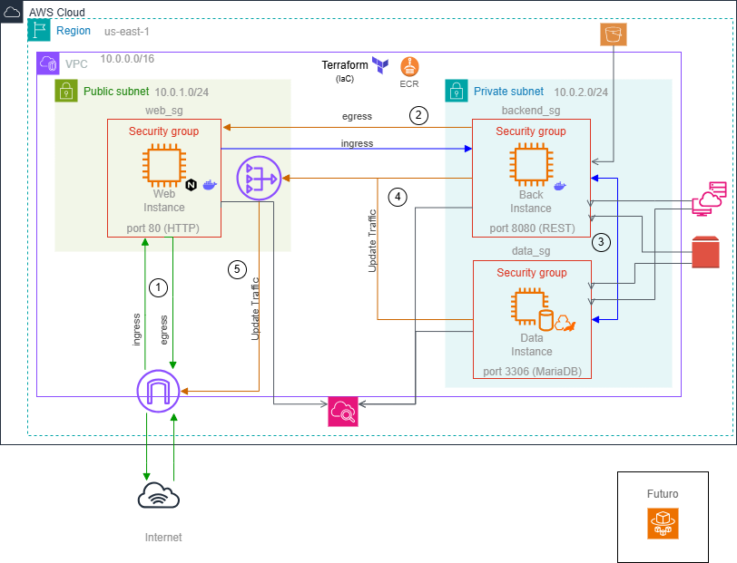

# Terraform AWS infraestructure

**Descripción**
Infraestructura gestionada con Terraform (IaC)

- 3 EC2's (y la tecnología correspondiente):
    - Web_server -> Docker, Git y Nginx
    - Back_server -> Docker y Git
    - Data_server -> MariaDB(Mysql)


> *Las instancias poseen el mínimo privilegio mediante IAM y SG's*

## 📂 Infraestructura del proyecto


````
eva1/
├── backend
├── frontend
├── infra/
│ ├── main.tf
│ ├── iam.tf
│ ├── compute.tf
│ ├── keys.tf
│ ├── network.tf
│ ├── security.tf
├──  .gitignore
└── README.md
````
**Desgloce**

| Lista | Descripción |
| ------------- | ------ |
| Compute   | Conlleva la información de templates y la formación de instancias. |
| network        | Posee la información de redes en donde se situan las máquinas y su comunicación con el mundo. |
| security  | Creación de los Secutiry Groups (limitación de la comunicación de entrada y salida). |

> *Solo se implementará la estructura de infra, puesto backend y frontend no cumplen funciones en estos momentos.*

## 🛠️ Requisitos previos

- Terraform v1.1x + (`terraform --version`)
- AWS CLI (`aws --version`)

## ⚙️ Indicaciones y sugerencias para infra
Procura cambiar los siguientes archivos por la información que poseas:

- **main.tf** -> region -> La región a la que pertenescas.
- **iam.tf** -> Solo si no se posee el ya escrito.
- **Security.tf** -> ingress ssh -> cird_blocks -> tu ip de pc (Ipv4).
- **compute.tf** -> image.id -> la id de tu imagen AMI según tu región.
- **network.tf** -> "aws_subnet" -> availability_zone -> cambia esto en las subnets según tu zona de disponibilidad.
- **keys.tf** -> public_key -> La llave generada mediante el comando `ssh-keygen -y -f "mi-llave.pem"` (Requiere la creación de una llave .pem primero y la ubiación luego de la descarga de la llave).

**Mejoras en posibles cambios**

Si llegas a cambiar el código de infra, según las sugerencias, usa:
- `terraform fmt` (Estética.)
- `terraform validation` (Procura que los resources estén bien escritos.)

## 🚀 Despliege
Luego de los cambios sugeridos (y algunos obligatorios), usa:
- `terraform plan`
- `terraform apply`

Para apagar las instancias, usa:
- `terraform destroy`

## 📦 Diagrama de AWS




